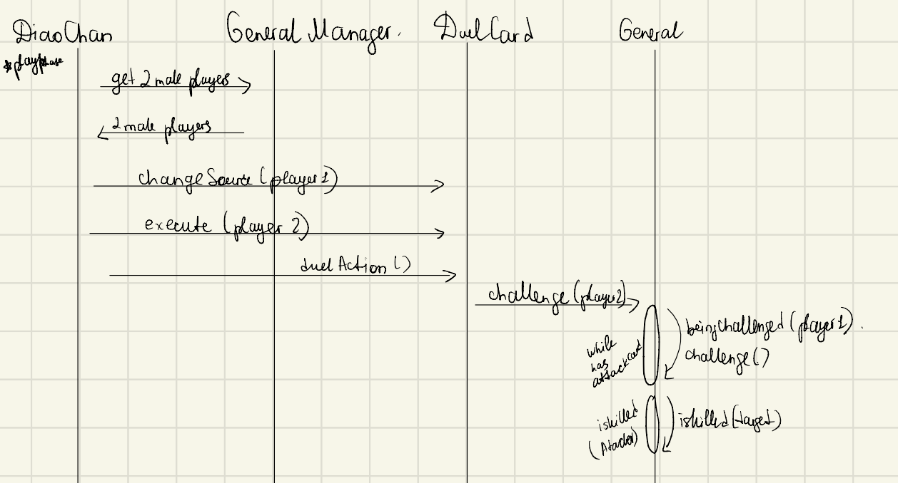
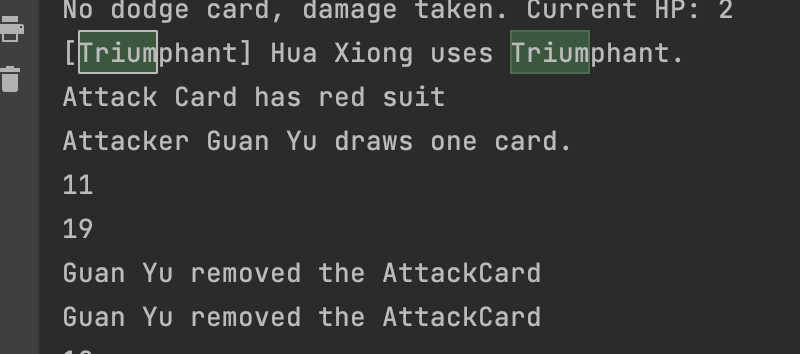

## War of Three Kingdoms Documentation

## 1. Creational Design Patterns

## 1.1 Singleton.

1. Singleton Pattern: The `GeneralManager` class is implemented as a singleton object. This ensures that there is only one instance of the `GeneralManager` throughout the game, providing a centralized point of access for managing generals and game-related operations.

## 1.2 Factory Pattern - Abstract Factory Pattern

1. Factory Method Pattern: The creation of lords and non-lords with attached identities is facilitated by the Factory Method pattern. This pattern allows the `GeneralManager` to create different types of generals based on their roles, providing flexibility and extensibility in terms of adding new general types in the future.

```
open class NonLordFactory(private val generalLord: General, private val lord: Lord) : GeneralFactory()
{

    private val nonLords = mutableListOf("Zhen Ji", "Xu Chu", "Sima Yi", "Diao Chan",
        "Lv Bu", "Zhuge Liang", "Guan Yu", "Zheng Fei",...)
    override fun createRandomGeneral(player: Player):General {
        val name = nonLords.random()
        nonLords.remove(name)
        var general = when (name)
        {
            "Zhen Ji" -> ZhenJi(player)
            "Xu Chu" -> XuChu(player)
            "Sima Yi" -> SimaYi(player)
            ...

            else -> throw IllegalArgumentException("Invalid Name")
        }
        general.currentHP = general.maxHP
        println(name + " ," +" a "+ general.identity +", has " + general.currentHP + " health point(s).")

        ...

        return general

    }
    override fun createPlayer(index: Int): Player {

        var player = when (index)
        {
            2 -> Loyalist()
            3 -> Rebel()
            ...
            else -> throw IllegalArgumentException("Invalid Index")
        }

        return player
    }
}
```

3. Delegation Pattern: The `General` class delegates the implementation of the `Player` interface to the player object. This delegation pattern allows for decoupling the player-specific logic from the `General` class, promoting modularity and enabling different player implementations without modifying the `General` class itself. It also allows us to look up identity of the player.

## Feature 1: isGameOver()

### 1. Overview:

The `isGameOver()` function is a crucial part of the General Manager class in the War of Three Kingdoms game. Its purpose is to determine whether the game has reached its conclusion. The game continues as long as the function returns `False`, making it a fundamental aspect of the game's core mechanics.

### 2. Feature Description:

The `isGameOver()` function is activated when any player is killed. It operates according to the following steps:

1. Retrieve the roles of all the generals who are still alive in the game. Each general is associated with a player object, and the General Manager class manages these objects.

> val livingPlayerRoles = list.map { it.identity }

2. Check for specific scenarios that would indicate the end of the game:

- Scenario 1: The Lord's demise. If the Lord general is no longer alive, the outcome depends on the survival of the Spy general. If the Spy is the only surviving general, they emerge as the victor. Otherwise, the Rebels claim victory.
- Scenario 2: The elimination of all Rebels and Spies. If there are no remaining Rebel or Spy generals, the Lord and the Loyalists triumph.

3. If any of the above scenarios occur, the game is considered over, and the function returns `True`. Otherwise, the game continues, and the function returns `False`.

By utilizing the `isGameOver()` function, the game can accurately determine whether any of the game-ending conditions have been met, allowing for the appropriate actions to be taken in response

### 3. Code Segment

- `isGameOver()` is called every time a player gets killed, which is checked inside the `isKilled()` function of `General.kt`:

```
    fun isKilled(attacker: General) : Boolean {
        if (currentHP == 0 || currentHP <0) {

            println("$name is killed. Player's Identity: ${player?.identity}")
            // iterate thru cards and discard
            val iterator = allCards.iterator()
            while (iterator.hasNext()) {
                val card = iterator.next()
                iterator.remove()
                CardManager.discarded.add(card)
            }
            // Remove player only if they are killed
            GeneralManager.list.remove(this)

            if (player.identity == "Rebel") {
                CardManager.draw(attacker, 3)
            }
            else if (player.identity == "Loyalist" && attacker.identity == "Lord") {
                attacker.allCards.clear()
            }

            println("Check if Game is over ...")
            if (GeneralManager.isGameOver()) {
                exitProcess(0)
            }

            return true
        }
        return false
    }
```

```
fun isGameOver(): Boolean {
    val livingPlayerRoles = list.map { it.identity }

    // The Lord is dead: The Spy will win if he/she is the only survivor. Otherwise, the Rebel wins.
    if (!livingPlayerRoles.contains("Lord")) {

        if (livingPlayerRoles.contains("Spy") && livingPlayerRoles.size == 1) {
            println("Spy wins!")
            return true
        } else {
            println("Rebel Wins!")
            return true
        }

    } else {
        println("Unsatisfied: The Lord is dead: The Spy will win if he/she is the only survivor. Otherwise, the Rebel wins. \n Check next condition... ")

    }

    // All Rebels and Spies are dead: The Lord and the Loyalists win.
    if (!livingPlayerRoles.contains("Rebel") && !livingPlayerRoles.contains("Spy")) {

        println("Lord and Loyalists win!")
        return true
    } else {
        println("Unsatisfied: All Rebels and Spies are dead: The Lord and the Loyalists win. ")
    }

    println("Game is not over yet!")

    // If none of the above conditions are met, the game is not over.
    return false
}
```

### 3. Design Patterns:

While the `isGameOver()` function does not adhere to a specific design pattern, it incorporates several design concepts that enhance the structure and functionality of the War of Three Kingdoms game.

## 4. Class Diagram


### 5. Sequence Diagram


### Feature 2: CardManager

### 1. Overview:

The `CardManager` class represents an object responsible for managing a deck of cards. It contains functionality to create a deck, discard cards, and draw cards for a given `General`. The deck consists of various types of cards such as `AttackCard`, `DuelCard`, `DismantleCard`, and `EightTrigrams`. The `originalCards` list holds the cards in the deck, while the `discarded` list stores the discarded cards.

```
object CardManager {
    val originalCards: MutableList<Card> = mutableListOf()
    val discarded: MutableList<Card> = mutableListOf()

    ...
```

## 2. Feature Description & Code:

1. `createDeck()` function: Creates a deck of cards by adding AttackCards, DuelCards, DismantleCards, and EightTrigrams based on specific rules defined in the code. Range cards are added later. The deck is shuffled after the cards are added.

- We have added cards based on proportions, simulating the game. Most of the cards are Attack Cards, then Duel, etc.

```
fun createDeck() {
        val suits = arrayOf("Spade", "Heart", "Club", "Diamond")
        val numbers = arrayOf("8", "9", "10", "J")

        // Add more AttackCards
        for (number in numbers) {
            for (suit in suits) {
                originalCards.add(AttackCard("Attack Card", number, suit, null))
            }
        }

        // Add a smaller number of DuelCards, DismantleCards, and EightTrigrams
        for (number in arrayOf("A", "2", "3", "4", "7")) {
            for (suit in suits) {
                originalCards.add(DuelCard("Duel", number, suit, null))
            }
        }

        for (number in arrayOf("5", "6")) {
            for (suit in suits) {
                originalCards.add(EightTrigrams("Eight Trigrams", number, suit))
            }
        }

        for (number in arrayOf("Q", "K")) {
            for (suit in suits) {
                originalCards.add(DismantleCard("Dismantle", number, suit))
            }
        }

        // Add more RangeCards
        originalCards.add(ShadowRunner())
        originalCards.add(FerghanaHorse())
        originalCards.add(HexMark())
        originalCards.add(RedHare())
        originalCards.add(FlyingLightning())
        originalCards.add(VioletStallion())

        // Shuffle the deck
        originalCards.shuffle()
    }
```

2. `discard(card: Card)` function: Removes a specified `card` from the `originalCards` list and adds it to the `discarded` list. Used when players use a card and remove it from their hands.

```
fun discard(card: Card) {
        originalCards.remove(card)
        discarded.add(card)

    }
```

3. `draw(general: General, numberOfCards: Int): List<Card>` function: Draws a specified number of cards from the deck for a given `general`. If there are less than 2 cards in the deck, the discarded cards are shuffled back into the deck. The top cards are then given to the `general`, added to their `allCards` list, and returned.

```
fun draw(general: General, numberOfCards: Int): List<Card> {
        println(originalCards.size)
        println(discarded.size)
        // If there are less than 2 cards in the original deck, shuffle the discarded cards back into the deck
        if (originalCards.size < 2) {
            println("Getting cards from discarded")
            discarded.shuffle()
            originalCards.addAll(discarded)
            discarded.clear()
        }

        // Give the top 2 cards to the general

        // TODO: check take
        val drawnCards = originalCards.take(numberOfCards)
        for(card in drawnCards)
        {
            if(card is AttackCard)
            {
                card.changeAttacker(general)
            }
        }
        originalCards.removeAll(drawnCards)
        general.allCards.addAll(drawnCards)

        return drawnCards
    }
```

### 3. Design Pattern: Singleton Object

The `CardManager` object is implemented as a Singleton, which ensures that only one instance of the `CardManager` is created throughout the application. This pattern is suitable because there should be a single point of access to the `CardManager` and its functionality.

### 4. Class Diagram


### 5. Sequence Diagram


## Feature 3, 4, 5, 6 Overall: Cards using Command Pattern

I have implemented `Dismantle Card`, `Duel Card`, `Attack Card`, `Eight Trigrams card` using `Command Design Pattern`. The reason is -- in the Command Pattern, **commands are encapsulated as objects**, allowing them to be **parameterized and executed at different points in time**, which is perfect as first cards have no target or no specific source, but can later be parameterized and executed during play phase or when someone is attacking them, so as to dismantle.

For all of these cards, they are under `Card interface/abstract class`, have suit, name, num and have `execute` property, which is Command Generator that is overwritten by every card. Also, may have changeSoure/Attacker function.

### 1. Class Diagram

- General invokes specific card card, which executes a specific command, based on the `execute` property, which is CommandGenerator that is overwritten by every card


### 2. Code

- Card Interface

```
// Command function generator
typealias CommandGenerator = (Player) -> () -> Unit


abstract class Card(val name: String, val num: String,public val suit: String) {
   // Capital letter for every suits
   val suitList: List<String> = listOf("Diamond", "Club", "Heart", "Spade")
   open val execute: CommandGenerator = { { } }


}
```

- If during the draw phase, player draws card that requies source/attacker, we set set it.

```
open fun drawPhrase()
{
    val drawnCards = CardManager.draw(this, 2)

    for (card in drawnCards) {
        if (card is DuelCard) {
            card.changeSource(this)
        }
        if (card is AttackCard) {
            card.changeAttacker(this)
        }
    }
    println(name + " draws" + drawnCards.size+ " cards and now has " + allCards.size + " card(s).")
}
```

## Now, each of the Cards in Detail...

## Feature 3: Duel Card + Alienation of Diao Chan

### 1. Overview

The Duel card is a powerful tool used in the War of Three Kingdoms game to inflict 1 unit of health damage to the loser of a duel. Additionally, it often results in the elimination of all the Attack (杀) cards held by one or both players involved in the duel. We use it to enable `Diao Chan`'s `[Alienation]' skill, where she chooses 2 male players to duel each other.

### 2. Feature Description

The Duel card enables players to engage in head-to-head combat, challenging a target player of their choice. The card is then discarded into the discard pile. The selection of the target player is not restricted by range, providing flexibility in choosing opponents.

To initiate the duel, both players involved must play an Attack card. The player who fails to play an Attack card first incurs 1 unit of health damage. This mechanism encourages strategic decision-making and quick thinking during the duel.

If the target player does not possess an Attack card or chooses not to use any, they immediately suffer 1 unit of health damage. This feature gives an advantage to the user of the Duel card, as it increases the likelihood of inflicting damage on the opponent.

Furthermore, a notable side-effect of the Duel card is its tendency to eliminate Attack cards from the hands of one or both players involved in the duel. This outcome often arises due to the requirement of playing Attack cards during the duel, resulting in the depletion of Attack card resources.

By employing the Duel card strategically, Diao Chan can not only inflict health damage on their opponents but also potentially disrupt their opponents' Attack card capabilities, gaining an advantageous position in the game.

### 3. Technical Description

Technical Description:

- The `DuelCard` class represents a card used for initiating a duel between players.
- It extends the `Card` class and overrides the `execute` property, which is a `CommandGenerator`.
- The `execute` property takes a target player and returns a command function that, when executed, initiates a duel between the source and the target player.
- When the command function is executed, it checks if the target is a `General` and calls the `challenge()` method on the source player, passing the target as a parameter.

```
class DuelCard(name: String, num: String, suit: String, private var source: General?) : Card(name, num, suit) {
    override val execute: CommandGenerator = { target ->
        {
            if (target is General) {

                source?.challenge(target)
            }
        }
    }

    open fun changeSource(general: General) {
        source=general
    }
}
```

### 4. How Duel Card is used

- Diao Chan initializes duel between two male players

```
class DiaoChan(player: Player): NeutralGeneral("Diao Chan",player) {
    override var maxHP = 3
    override var gender: String? = "female"

    override fun playPhase() {
        super.playPhase()

        val duelCard: DuelCard? = allCards.find { it is DuelCard } as? DuelCard

        if (duelCard != null) {

            println("[Alienation] Select two male players to Duel Each Other")

            // Filter the list for male players
            val malePlayers = GeneralManager.list.filter { it.gender == "male" }

            // Ensure there are at least 2 male players
            if (malePlayers.size < 2) {
                println("Not enough male players for a duel")
                return
            }

            // Randomly select 2 male players
            val playersToDuel = malePlayers.shuffled().take(2)
            println("Duel: " + playersToDuel[0].name + " VS. " + playersToDuel[1].name)


            // Execute the duel action for each selected player
            duelCard.changeSource(playersToDuel[0])

            val duelAction = duelCard.execute(playersToDuel[1])
            duelAction()
            removeCard(duelCard)
        }
    }

    ...

}
```

- In `General.kt` challenge is called to challenge the target and loop is initiated, where two players duel each other using `challenge(target)` & `beingChallenged(attacker)`:

```
open fun challenge(target: General): Boolean {

    // may play attack card or not
    while (target.beingChallenged(this)) {
        if (this.hasAttackCard() && this.useAttackCard(target)) {
            println("[AttackCard] used")
            val attackCard:AttackCard = allCards.find { it is AttackCard } as AttackCard
            if(attackCard!=null)
            {
                removeOneAttackCard(attackCard)
            }
        } else {
            println(name + " loses the challenge and loses 1 HP.")
            currentHP--
            isKilled(target)
            return false
        }
    }
    return true
}
```

```
open fun beingChallenged(attacker: General): Boolean {
    if (this.hasAttackCard() && this.useAttackCard(attacker)) {

        println(name + " is attacking.")

        return true
    } else {
        println(name + " loses the challenge and loses 1 HP.")
        currentHP--

        isKilled(attacker)
        return false
    }
}
```

### 5. Simulation Result


Here, Diao Chan activates the Alienation skill and selects two male players to duel each other. Them Diao Chan removes the card and discards cards to suit currentHP.

### 6. Class Diagram


### 7. Sequence Diagram



### 8. Testing Considerations

Since in our game, Duel Card is used only for Diao Chan, it is not very frequent. When testing, make ure Diao Chan is in the game.

## Feature 4: Attack Card

### 1. Overview

One of the base cards in the game, which can reduce the currentHP of the target and even kill it, making the game end. Attack Card is later used as a parent of other Attack Cards.

### 2. Technical Description:

- The `AttackCard` class represents a card used for attacking in the game.
- It extends the `Card` class and overrides the `execute` property, which is a `CommandGenerator`.
- The `execute` property takes a target player and returns a command function that, when executed, performs the attack action.
- When the command function is executed, it checks if the target is a `General` and if the target is within attacker’s attack range and calls the `beingAttacked()` method on the target, passing the attacker (`attacker` property) as a parameter, which was set when the player has drawn card.

Attack Cards can also be used during other places, such as Duel, all of which are supported using `useAttackCard()`, which checks if the player has an attack card and invokes it when needed.

```
open class AttackCard(name: String, num: String, suit: String, var attacker: General?) : Card(name, num, suit) {
    open var attackRange = 1
    override val execute: CommandGenerator = { target ->
        {
            if(attacker == null)
            {
                println("Attacker is null")
            }
            else if(target is General && attacker?.distance?.get(target.name) == null)
            {
                println("Target is null")
            }
            else if (target is General && attacker?.distance?.get(target.name)!! <= attackRange) {
                println("Attack is within the range")
                attacker?.let { target.beingAttacked(attacker!!) }
                attacker?.removeOneAttackCard(this)

            } else {
                println("Attack is not in range")
            }
        }
    }
    fun changeAttacker(general: General?)
    {
        attacker = general
    }
}
```

### 3. Code

When Attack Card is invoked, it executes `beingAttacked(attacked)` on the target player's instance.

```
    open fun beingAttacked(attacker: General) {

        println(name + " being attacked.")

        if (dodgeAuto) {
            println("[Eight Trigrams] autododge worked.")
            dodgeAuto=false

        } else if (hasDodgeCard()) {
            ...
        } else if (hasDismantleCard()) {
            ...
        } else {
            currentHP -= 1

            if (!isKilled(attacker)) {
                println("No dodge card, no dismantle card, damage taken. Current HP: $currentHP")
                if (player is Lord) {
                    player.notifyObservers(false)
                }
            } else {
                println(name + "'s Current HP less that or equal to zero")
            }

        }
    }
```

- We also use `useAttackCard()` during the Duel

```
fun useAttackCard(attacker: General): Boolean {
    val attackCard = allCards.find { it is AttackCard } as? AttackCard

    // If an AttackCard is found, execute it
    if (attackCard != null && attackCard is AttackCard) {
        println("[Attack Card] " + name + "uses Attack Card against " + attacker.name)

        attackCard.execute(attacker) // Assuming list[7] is the target

        return true
    }

    return false
}
```

### 4. Simulation Result


Here, Sun Quan uses Attack Card against Hua Xiong. `beingAttacked(attacker)` gets activated for Hua Xiong. Hua Xiong will use his skill later.

### 5. Class Diagram


### 6. Sequence Diagram


## Feature 5: Eight Trigrams

### 1. Overview

The Eight Trigrams card is a powerful defensive card that automatically triggers the dodge (闪) ability whenever it is required. It relies on passing a judgement card to determine its activation. If the judgement card is a red suit (hearts or diamonds), the Eight Trigrams card will automatically dodge the attack, providing a significant advantage in combat.

### 2. Feature Description

1. Automatic Dodge: The Eight Trigrams card offers an automatic dodge ability whenever a dodge is required during gameplay. It eliminates the need for the player to manually play a dodge card and relies on the judgement card to activate the dodge.

2. Red Suit Judgement: To activate the Eight Trigrams card's dodge ability, a judgement card must be played. If the judgement card is of a red suit (hearts or diamonds), the Eight Trigrams card will automatically dodge the attack.

3. Defensive Advantage: By equipping the Eight Trigrams card during a player's turn, it provides a reliable defense mechanism. The player can rely on the card to automatically dodge incoming attacks, potentially turning the tide of battle in their favor.

### 3. Technical Description

- The `EightTrigrams` class represents a card with the ability to dodge attacks.
- It extends the `Card` class and overrides the `execute` property, which is a `CommandGenerator`.
- The `execute` property takes a player and returns a command function that, when executed, allows the player to dodge attacks.
- When the command function is executed during the judgement phase, it checks if the player is a `General` and calls the `dodge()` method on the player, passing the suit and the attacker (`attacker` property) as parameters.
- If the card is red suit, it will set `autoDodge` to true, so that when the player is attacked next time, dodge gets activated.

### 4. Code

```
class EightTrigrams(name: String, num: String, suit: String) : Card(name, num, suit) {
    override val execute: CommandGenerator = { player ->
        {
            if (player is General) {
                player.dodge(suit)
            }
        }
    }
}
```

- During judgement phase, check if player has `EightTrigrams` and execute if they do.

```
fun executeCommand() {
    for (i in timeSpellCards) {
        i.invoke()
    }


    for (i in 0 until allCards.size) {
        val card = allCards[i]
        if (card is AttackCard) {
            ...
        }
        else if (card is EightTrigrams) {
            println(" [Eight Trigrams] : $name")

            val eightTrigramsAction = card.execute(this)
            eightTrigramsAction()

            removeCard(card)
            break // Break the loop as the list has been modified
        }
    }

    timeSpellCards.clear()
}
```

- Execute will activate dodge(suit) via `General.kt`

```
fun dodge(suit: String) {

        println(name + " is checking AutoDodge.")

        // if red suit -> dodged automatically
        if ((suit == "Hearts") or (suit == "Diamonds")) {
            println(name + " activated autoDodge by RED card.")
            dodgeAuto = true

        } else {
            println(" Could not activate autoDodge")

        }
    }
```

### 5. Simulation results

- Activated `autoDodge`.
  
- Could not activate `autoDodge`
  

### 6. Class Diagram


### 7. Sequence Diagram


## Feature 6: Dismantle Card

### 1. Overview

The Dismantle card is a versatile and powerful card that allows players to dismantle and remove any card from any player during gameplay. It can be used to target equipped weapons, armor, horses, cards in hand, and even specialized cards like Time-Delay Tool Cards and Lightning. It offers players a strategic advantage by allowing them to disrupt their opponents' strategies and remove key cards from play.

### 2. Technical Description

- The `DismantleCard` class represents a card used for dismantling cards from the target player's hand.
- It extends the `Card` class and overrides the `execute` property, which is a `CommandGenerator`.
- The `execute` property takes a target player and returns a command function that, when executed, performs the dismantle action on the target player.
- When the command function is executed, it checks if the target is a `General` and calls the `dismantleCard()` method on the target.

### 3. Code

```
class DismantleCard(name: String, num: String, suit: String) : Card(name, num, suit) {
    override val execute: CommandGenerator = { target ->
        {
            if (target is General) {
                target.dismantleCard()
            }
        }
    }
}
```

- In our case, when a player is attacked, if he/she has DismantleCard, we execute it and do not suffer any damage.

```
    open fun beingAttacked(attacker: General) {

        println(name + " being attacked.")

        if (dodgeAuto) {
            ..

        } else if (hasDodgeCard()) {
            ...
        } else if (hasDismantleCard()) {

            // Find DismantleCard from allCards
            val dismantleCard = allCards.find { it is DismantleCard }

            // If a DismantleCard is found, execute it and remove it from allCards
            if (dismantleCard is DismantleCard) {
                val dismantleAction = dismantleCard.execute(attacker)
                dismantleAction()

                println(" [DISMANTLE] : $name dismantled ${attacker.name}")

                removeCard(dismantleCard)
            }

        } else {
            currentHP -= 1

            ...
        }
    }
```

- By executing Dismantle Card, we execute `dismantleCard()` on the attacker, causing them to use one card.

```
fun dismantleCard() {
    if (allCards.isNotEmpty()) {
        val randomIndex = Random.nextInt(allCards.size)
        println(name + " lost one card because of Dismantle.")
        allCards.removeAt(randomIndex)
    }
}
```

### 4. Simulation results

Here, Xu Chu was being attacked by Lv Bu, but Lv Bu used dismantle card and made Lv Bu lose one random card. Other that that, Lv Bu also removed attack card. Xu Chu removed Dismantle card.


### 5. Class Diagram


### 6. Sequence Diagram


## Feature 7. Hua Xiong Triumphant

### 1. Overview

When a character deals damage to Hua Xiong with an [Attack] card that belongs to the Red suit, he/she recover 1-point health or draw 1 card.

### 2. Code

- Override `beingAttacked(attacker)` for Hua Xiong. If damage is done, find Attack Card that was used to inflict damage from the top of the discarded pile using `CardManager`, check suit.
- According to the suit, attacker either draws one card or recovers 1 HP.

```
class HuaXiong(player: Player): NeutralGeneral("Hua Xiong",player) {
    override var maxHP = 3
    override var gender: String? = "male"

    override fun beingAttacked(attacker: General) {
        println(name + " being attacked.")
        if (hasDodgeCard()) {
            ...
        } else {

            currentHP -= 1

            println("No dodge card, damage taken. Current HP: $currentHP")
            if (player is Lord) {
                player.notifyObservers(false)
            }

            println("[Triumphant] Hua Xiong uses Triumphant.")

            // Finding attack card from the top of discard pile
            var attackCard: AttackCard? = null
            attackCard = CardManager.discarded.find { it is AttackCard } as AttackCard?

            if (attackCard != null ) {
                // Generate a random number between 0 (inclusive) and 2 (exclusive)
                println("Attack Card has red suit")
                val randomNumber = (0 until 2).random()

                if (randomNumber == 0) {
                    // 50% chance to recover 1 point of health
                    println("Attacker " + attacker.name + " recover 1 HP.")
                    attacker.currentHP += 1
                } else {
                    // 50% chance to draw 1 card
                    println("Attacker " + attacker.name + " draws one card.")
                    CardManager.draw(attacker, 1)
                }
            }
            if (isKilled(attacker)) {
                println(name + "'s Current HP less that or equal to zero")

            }
        }
    }
}
```

### 3. Simulation Result



## Small Features

### 1. Player's Death - `General.kt`

- When a player’s current health drops to 0, he/she enters into a state of dying unless he/she is saved by [Peach (Lord Ability)]. Otherwise, they shall reveal his/her Identity Card and discard all of his/her cards in the judgement zone. Any reward or punishment will be implememt thereafter:

* Any player may get 3 cards immediately if he/she kills a Rabel.
* If the Lord kills a Loyalist, he/she need to discard all of his/her cards.

```
    fun isKilled(attacker: General) : Boolean {
        if (currentHP == 0 || currentHP <0) {

            println("$name is killed. Player's Identity: ${player?.identity}")
            // iterate thru cards and discard
            val iterator = allCards.iterator()
            while (iterator.hasNext()) {
                val card = iterator.next()
                iterator.remove()
                CardManager.discarded.add(card)
            }
            // Remove player only if they are killed
            GeneralManager.list.remove(this)

            if (player.identity == "Rebel") {
                CardManager.draw(attacker, 3)
            }
            else if (player.identity == "Loyalist" && attacker.identity == "Lord") {
                attacker.allCards.clear()
            }

            println("Check if Game is over ...")
            if (GeneralManager.isGameOver()) {
                exitProcess(0)
            }

            return true
        }
        return false
    }
```

- Saved by Peach:

```
class SunQuan(player: Player): WuGeneral("Sun Quan", player) {
    override var maxHP = 5
    override var gender: String? = "male"
    override fun beingChallenged(attacker : General):Boolean {
        var flag = super.beingChallenged(attacker)
        if(!isKilled(attacker))
        {

            if(!flag)
            {
                println("[Rescue] Sun Quan activates Lord Skill Rescue.")
                flag = handleRequest()
                if(flag)
                {
                    currentHP++
                }
            }

        }
        return flag

    }
}
```

### 2. Keep Track of numOfCard properly

- Discard cards by removing them from hand and adding to discarded deck if cards are more than current HP.

```
open fun discardPhrase() {
        println("$name has ${allCards.size} card(s), current HP is $currentHP.")
        var discarded = 0

        // If there are more cards than currentHP, discard the excess cards
        while (allCards.size > currentHP && allCards.size > 0) {
            val cardToDiscard = allCards.random() // Select a random card to discard
            removeCard(cardToDiscard)
            discarded+=1
        }

        println("$name discards $discarded card(s), now has ${allCards.size} card(s).")
    }
```

### 3. Remove Card from hand and all to discarded

```
fun removeCard(card: Card) {
        val cardToDelete = allCards.find { it == card }
        if (cardToDelete != null) {
            println("$name removed the card")
            allCards.remove(cardToDelete)
            CardManager.discard(cardToDelete)
        }
    }
```

....

## Remarks

Thank you to Dr. Martin for helping debug and giving direction during project planning! Also, it was good team work, although it took me a lot of time to understand the game :)
